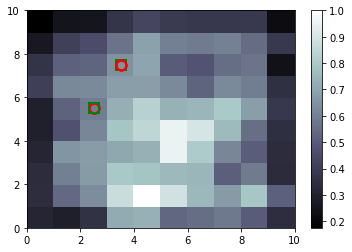

# SOM-on-Credit-Card-Fraud-Detection

<h1>What is Self Organising Map</h1>

<p>A self-organizing map (SOM) or self-organizing feature map (SOFM) is a type of artificial neural network (ANN) that is trained using unsupervised learning to produce a low-dimensional (typically two-dimensional), discretized representation of the input space of the training samples, called a map, and is therefore a method to do dimensionality reduction. Self-organizing maps differ from other artificial neural networks as they apply competitive learning as opposed to error-correction learning (such as backpropagation with gradient descent), and in the sense that they use a neighborhood function to preserve the topological properties of the input space.</p>

<h2>Credit Card Fraud Detection</h2>

In this dataset here have lots of customers card data with unlabeled. Basically this is a Unsupervised datset so we have to find how much fraud here have in the dataset.


This is a Self Organising Map implement on Credit Card Fraud  Detection using an Unlabeled or Unsupervised dataset.
After plotting SOM using matplotlib library in python its look like this black portion is the fraud area and white is the normal card information. In this dataset, there have fifteen input features. I am making ten by ten grid for SOM (Self Organising Map). Som is one of the most powerful clustering technique for unsupervised learning.Here in this repository, i build my own Self Organizing Map From Scratch using an Unsupervised dataset for making a robust Credit Card Fraud Detection Model.

<h3>Training rhe model</h3>

```
>>>from minisom import MiniSom
>>>som = MiniSom(x = 10, y = 10, input_len = 15, sigma = 1.0, learning_rate = 0.5)
>>>som.random_weights_init(x)
>>>som.train_random(data = x, num_iteration = 100)

```
<h3>Visualizing the results</h3>

```
>>>from pylab import bone, pcolor, colorbar, plot, show
>>>bone()
>>>pcolor(som.distance_map().T)
>>>colorbar()
>>>markers = ['o', 's']
>>>colors = ['r', 'g']
>>>for i, n in enumerate(x):
>>>    w = som.winner(n)
>>>   plot(w[0] + 0.5,
         w[1] + 0.5,
         markers[y[i]],
         markeredgecolor = colors[y[i]],
         markerfacecolor = 'None',
         markersize = 10,
         markeredgewidth = 2)
>>>show()

```

